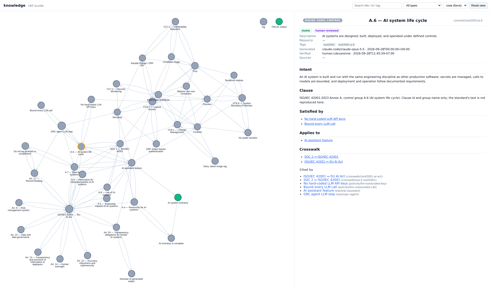

# grc-evidence

Turns security scans into compliance evidence for SOC 2, ISO/IEC 42001 and the EU AI Act. Code decides status. An LLM drafts prose. A person reviews.

> **This is a work in progress.**

An [Open Knowledge Format](https://github.com/GoogleCloudPlatform/open-knowledge-format)
(OKF) knowledge bundle, plain Markdown that any OKF tool can read, grounds a
compliance engine (the `grc-evidence` package and its `grc` CLI) and an agent skill.
Together they scan an app, map each finding to a SOC 2 / NIST SP 800-53,
ISO/IEC 42001, or EU AI Act control, emit OSCAL, and write an auditor-facing
report.

*Organize knowledge → derive intelligence → take action.*

**See it on a real app:** [grc-evidence-boutique](https://github.com/cdevarenne/grc-evidence-boutique)
applies the released engine to Google's
[microservices-demo](https://github.com/GoogleCloudPlatform/microservices-demo),
included unmodified: 422 findings mapped to controls (7 not satisfied), 42 of 47
coverage-gap rules triaged into controls, a compliance gate on every pull
request and a nightly scan, and an agent's draft shown with the review that
corrected it. The [one-page case study](https://github.com/cdevarenne/grc-evidence-boutique/blob/main/docs/case-study.md)
has the figures and what the review changed in the engine.

> **`app/` is intentionally vulnerable.** It exists only as a scan target, with
> seeded issues listed in [`app/SEEDED.yaml`](app/SEEDED.yaml). Do not deploy it.

> **Clean-room** Everything here is generic and self-contained: the sample app,
> the Rego policies, and the OSCAL output. No proprietary data, configuration,
> or control text is included.

## What it does

1. **Scan** the target with four pinned scanners: Semgrep, Trivy, Checkov,
   Conftest.
2. **Map** each finding to a control, only through a `rule_ids` declaration a
   person reviewed in the bundle.
3. **Report**: OSCAL component definition, assessment plan, and assessment
   results; an auditor-facing `report.md`; and `run.json`, which records the
   commit, the versions, and the sha256 of every output.
4. **Optionally** add an LLM summary per control and LLM proposals for coverage
   gaps. Neither ever changes a status.

### How grounding works

A finding reaches a control only through a `rule_ids` declaration in the bundle.
A finding with no declaration is reported as a **coverage gap**, never mapped by
guesswork. The scan surfaces dozens of such gaps; each one is a rule the bundle
has not yet claimed for any control.

Here is what a [sample report](examples/report.md) looks like after running a scan,
with its [OSCAL documents](examples/oscal/). Both are generated by `make examples`
(which runs `make scan` against the sample app). Its LLM lines come from
`make examples-llm`, which narrates that same scan (`LLM_MODE=anthropic` or
`claude-cli`); a plain `make examples` drops them. CVE counts change as Trivy's vulnerability
database updates.


## Set up and run

Requires [uv](https://docs.astral.sh/uv/); `make bootstrap` installs Python 3.14 dependencies and the pinned scanners.

```
make bootstrap         # uv sync + install pinned scanners into .tools/
make scan              # grc run: out/findings.json, mapping.json, oscal/*.json, report.md, run.json
make render            # out/knowledge-viz.html — the OKF graph
make narrate           # optional: LLM prose per control, validated, then re-render and update run.json (LLM_MODE=anthropic)
make triage            # optional: LLM proposals for coverage gaps → out/proposals.json (review only)
make eval-triage       # optional: score triage variants on labeled gaps (tune + holdout) via the Batch API
make audit             # supply chain: the engine's dependencies (Trivy) and workflows (zizmor)
make test              # unit + Rego + Semgrep rule tests
make test-integration  # full scan; asserts every seeded issue lands where expected
make clean             # remove out/
```

Supported platforms: macOS arm64 and Linux x86_64 (the pinned scanner binaries).


## Use it

- **With a coding agent:** the `grc-continuous-compliance` skill (`grc install-skill` adds it to another repo)
  runs the pipeline and summarizes it, and leaves every status, mapping, and
  suppression decision to a person. See [docs/using-the-skill.md](docs/using-the-skill.md).
- **From any MCP-capable agent:** `grc mcp` serves the repo's results (scan, control status, findings, gaps,
  suppressions, the gate), with scanner text marked untrusted. See [docs/mcp.md](docs/mcp.md).
- **As an agent workflow:** `grc agent posture` drafts a summary for the repository's owner with only
  read tools, and writes it only if every number and status checks out against the tool results.
  See [docs/agents.md](docs/agents.md).
- **In another repo:** install the engine, `grc init`, then `grc run`. See
  [docs/new-repo.md](docs/new-repo.md) for what it brings in and what you write.
- **In CI:** how this repo tests and releases itself, and a starting point for
  your pipeline: [docs/ci.md](docs/ci.md).

## Knowledge graph



*The OKF knowledge bundle (`knowledge/`) rendered by the OKF reference visualizer
(`make render` → `out/knowledge-viz.html`). Each node is one concept file — a SOC 2,
ISO/IEC 42001, or EU AI Act control, a crosswalk, a guardrail policy, a scanner,
a stack component, or a suppression — and each edge is a markdown link between
them. It is a browsing aid; the scan pipeline reads the same files
directly and does not use the graph.*

## Further reading

| Document | What it covers |
|---|---|
| [Architecture](docs/architecture.md) | How the parts fit, a diagram, and the order to build the proposed features in |
| [Outputs](docs/outputs.md) | The output contract, the run manifest, and the OSCAL documents |
| [OSCAL subset](docs/oscal-subset.md) | Exactly which OSCAL fields are emitted, and the placeholders |
| [Suppressions](docs/suppressions.md) | Reviewed, expiring decisions about single findings |
| [AI governance](docs/ai-governance.md) | ISO/IEC 42001 and EU AI Act coverage, risk tiers, AI SDKs |
| [LLM step and cost](docs/llm.md) | Narration and triage: validation, cost, and the triage evaluation |
| [Limits](docs/limits.md) | What grc-evidence does not do, or does only partly |
| [How this was built](docs/how-this-was-built.md) | Specs, plans, human gates, measurements |
| [Status and roadmap](docs/roadmap.md) | Where the project stands and what is next |
| [Specs and plans](docs/superpowers/) | The written record behind each change |

## Layout

| Path | What |
|---|---|
| `app/` | clean-room Django/DRF sample app, Dockerfile, Kubernetes, Terraform |
| `knowledge/` | the OKF bundle: controls, stack, guardrail policies, scanners |
| `policies/` | Rego guardrails (+ tests) and a vendored Semgrep rule |
| `.claude/skills/grc-continuous-compliance/` | the skill (`SKILL.md`), a copy of `src/grc_evidence/data/skill/` |
| `src/grc_evidence/` | the engine: the `grc-evidence` package and its `grc` CLI; `data/` holds `tools.lock`, the scanner bootstrap, and the base bundle and policies that `knowledge/` and `policies/` copy |
| `docs/` | design spec, implementation plan, OSCAL subset |
| `examples/` | a sample report and OSCAL documents produced by `make examples`; triage eval results |

## Pins

All external versions are pinned in [`tools.lock`](src/grc_evidence/data/tools.lock): Semgrep, Checkov,
Trivy, Conftest, the OKF spec (v0.2, by commit), and OSCAL 1.2.3. Trivy and
Conftest are checked against SHA-256 pins; Semgrep and Checkov, with every
dependency, install only from hash-pinned requirements in
[`src/grc_evidence/data/locks/`](src/grc_evidence/data/locks/) (`make lock-scanners`
regenerates them after a version change). The OSCAL output is a documented
subset: see [`docs/oscal-subset.md`](docs/oscal-subset.md).

## License

MIT
