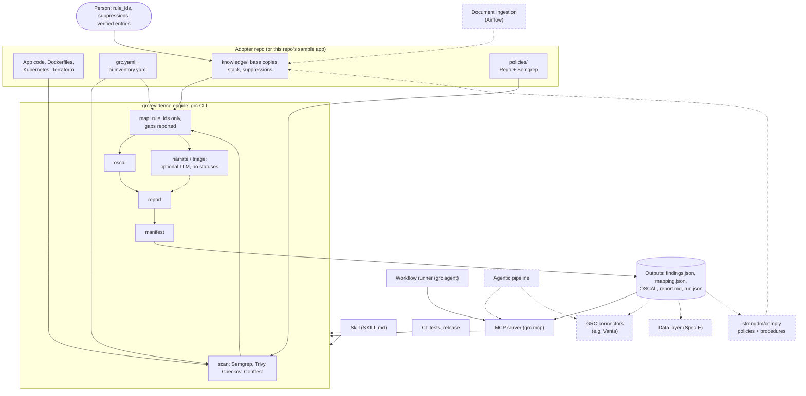

# Architecture

How grc-evidence fits together today, where the proposed features would attach, and
the order to build them in. Built parts are described from the code at
`v1.8.1`; proposed parts are marked as such and are not specified unless a spec
is linked.

## What is built

| Layer | What it is | Where |
|---|---|---|
| **Knowledge** | An OKF bundle of plain Markdown concepts: controls (SOC 2, ISO/IEC 42001, EU AI Act), crosswalks, scanners, guardrail policies with their `rule_ids`, the stack, suppressions. Reusable concepts ship with the engine as the base bundle; an adopter's `knowledge/` holds copies plus its own stack and suppressions. | `src/grc_evidence/data/base/`, `knowledge/` |
| **Engine** | The `grc-evidence` package and its `grc` CLI: scan with four pinned scanners, normalize, map findings to controls only through `rule_ids`, emit OSCAL, render the report, write the run manifest. Deterministic. | `src/grc_evidence/` |
| **Layout** | `grc.yaml`: which files each scanner reads and which policies it applies, checked to stay inside the repo. | `src/grc_evidence/config.py` |
| **Output contract** | `findings.json`, `mapping.json`, and `run.json` (commit, versions, layout, the sha256 of every output), each with a JSON Schema and a `schema_version`. OSCAL 1.2.3 component definition, assessment plan, and assessment results carrying the run id. | `src/grc_evidence/data/schemas/`, `docs/oscal-subset.md` |
| **LLM steps** | Optional, never change a status: `grc narrate` (prose per control, validated) and `grc triage` (proposed control or `none` per coverage gap, for a person to apply). | `src/grc_evidence/narrate.py`, `triage.py`, `llm.py` |
| **Agent entry** | A skill (`SKILL.md`) that calls `grc` and leaves every status, mapping, and suppression decision to a person; `grc mcp`, an MCP server whose tools run the pipeline and read its outputs, with scanner text marked untrusted; and `grc agent`, which runs a workflow with only its allowlisted tools and writes a draft only if it passes validation against the tool results. | `src/grc_evidence/data/skill/`, `src/grc_evidence/mcp_server.py`, `src/grc_evidence/agent.py`, `docs/mcp.md`, `docs/agents.md` |
| **Adoption** | `grc init` copies the base bundle and policies into a repo and writes starters; `grc check` reports drift from the base and unreviewed concepts; `grc sync-base` updates the copies to a newer engine's base. | `src/grc_evidence/adopt.py` |
| **CI** | Tests on every push and pull request; a version tag releases. | `.github/workflows/` |

## Diagram

Solid: built. Dashed: proposed, not built.

## The proposed features

| Proposal | Recorded in | One line |
|---|---|---|
| Data layer | [Spec E](superpowers/specs/2026-09-29-mini-spec-e-compliance-data-layer.md) | Postgres + pgvector projection of the bundle and of scan history |
| GRC platform connectors | Spec F §7 | Push results to a platform such as Vanta |
| Agentic pipeline | Spec F §7 | An agent runs this and other tools, triages, and calls the connectors, with approval gates |
| strongdm/comply | #52 | Policies and procedures next to the scan evidence |
| Document ingestion (Airflow not required) | #53 | A team's own documents into the agentic loop |

## Recommended order

1. Fix #56 (stale narratives) before anything publishes the report.
2. Spec F Part B, the adopter repo and its CI: built as
   [grc-evidence-boutique](https://github.com/cdevarenne/grc-evidence-boutique).
3. MCP server, read-mostly: built in 1.6.0 ([docs/mcp.md](mcp.md)).
4. The agentic workflow, narrowed to proposing:
   [Spec G](superpowers/specs/2026-10-01-mini-spec-g-agentic-workflows.md). Its
   workflow runner and first workflow (`posture`) are built
   ([docs/agents.md](agents.md)).
5. One GRC connector, after its semantic mapping is written down.
6. comply by files; ingestion without Airflow; the data layer when a consumer
   needs it.
