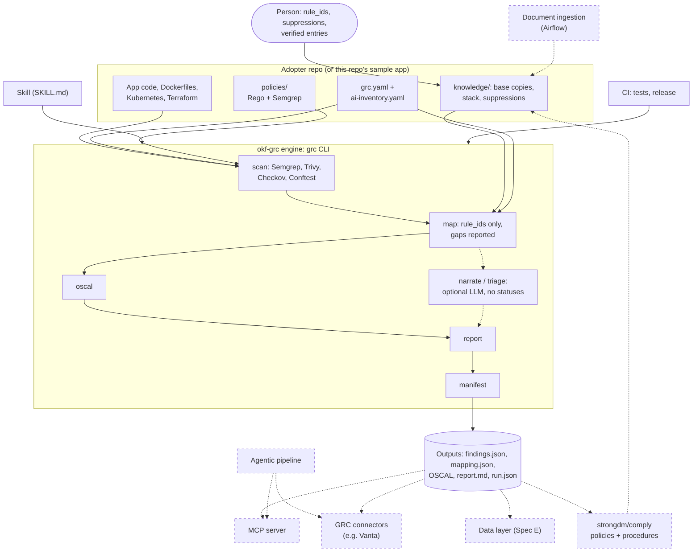

# Architecture

How okf-grc fits together today, where the proposed features would attach, and a
skeptical review of those proposals. Built parts are described from the code at
`v1.1.0`; proposed parts are marked as such and are not specified unless a spec
is linked.

## What is built

| Layer | What it is | Where |
|---|---|---|
| **Knowledge** | An OKF bundle of plain Markdown concepts: controls (SOC 2, ISO/IEC 42001, EU AI Act), crosswalks, scanners, guardrail policies with their `rule_ids`, the stack, suppressions. Reusable concepts ship with the engine as the base bundle; an adopter's `knowledge/` holds copies plus its own stack and suppressions. | `src/okf_grc/data/base/`, `knowledge/` |
| **Engine** | The `okf-grc` package and its `grc` CLI: scan with four pinned scanners, normalize, map findings to controls only through `rule_ids`, emit OSCAL, render the report, write the run manifest. Deterministic. | `src/okf_grc/` |
| **Layout** | `grc.yaml`: which files each scanner reads and which policies it applies, checked to stay inside the repo. | `src/okf_grc/config.py` |
| **Output contract** | `findings.json`, `mapping.json`, and `run.json` (commit, versions, layout, the sha256 of every output), each with a JSON Schema and a `schema_version`. OSCAL 1.2.3 component definition, assessment plan, and assessment results carrying the run id. | `src/okf_grc/data/schemas/`, `docs/oscal-subset.md` |
| **LLM steps** | Optional, never change a status: `grc narrate` (prose per control, validated) and `grc triage` (proposed control or `none` per coverage gap, for a person to apply). | `src/okf_grc/narrate.py`, `triage.py`, `llm.py` |
| **Agent entry** | A skill (`SKILL.md`) that calls `grc` and leaves every status, mapping, and suppression decision to a person. | `.claude/skills/grc-continuous-compliance/` |
| **Adoption** | `grc init` copies the base bundle and policies into a repo and writes starters; `grc check` reports drift from the base and unreviewed concepts. | `src/okf_grc/adopt.py` |
| **CI** | Tests on every push and pull request; a version tag releases. | `.github/workflows/` |

## Diagram

Solid: built. Dashed: proposed, not built.

## The proposed features

| Proposal | Recorded in | One line |
|---|---|---|
| Adopter repo for `microservices-demo`, with CI | Spec F Part B | Prove the engine on code it was not built around |
| Data layer | [Spec E](superpowers/specs/2026-09-29-mini-spec-e-compliance-data-layer.md) | Postgres + pgvector projection of the bundle and of scan history |
| MCP server | Spec F §7 | Any MCP-capable agent can run a scan and read results |
| GRC platform connectors | Spec F §7 | Push results to a platform such as Vanta |
| Agentic pipeline | Spec F §7 | An agent runs this and other tools, triages, and calls the connectors, with approval gates |
| strongdm/comply | #52 | Policies and procedures next to the scan evidence |
| Document ingestion with Airflow | #53 | A team's own documents into the agentic loop |

## Skeptical review

Each proposal is judged on what it adds over what is built, what could go wrong,
and whether something smaller gets the same result.

### Cross-cutting

- **Three proposals each want to be the place documents and history live**: the
  Spec E data layer, a GRC platform (through a connector), and an ingestion
  pipeline's store. Building more than one before a consumer needs it creates
  three copies that drift. Today git plus `run.json` already gives a
  reproducible history of every committed scan. Decide one system of record per
  kind of data before building any store.
- **The trust boundary moves outward.** Every built part keeps one rule: a
  finding reaches a control only through a `rule_ids` line a person reviewed,
  and scanned text is data, never instructions. Each proposal adds a new way in
  for untrusted text (MCP tool results, platform data, ingested documents) and a
  new way out for results (connector writes). Each spec must state how the rule
  survives, with a test, not a sentence.
- **Cost and determinism.** Everything built runs without a paid model API
  (`replay`, or `claude-cli` on a plan). An agent running unattended in CI needs
  a paid API and is not deterministic. That is a budget decision and a testing
  problem (recorded fixtures, eval sets), not a detail.
- **A known defect to fix first:** the report can show LLM narratives written for
  an earlier scan (#56). Anything that publishes the report (a connector, an
  agent) would publish that too.

### Adopter repo (Spec F Part B): do first

Highest value per effort: it tests every built layer on a real layout (C2
config, base bundle split, SDK-aware evidence with the LangChain service). Risk:
the demo app's layout needs Helm or Kustomize rendering for some manifests (the
shopping assistant exists only as a Kustomize component); scanning only static
files must be reported as a limit, not hidden.

### MCP server: second, and thin

Low risk if it only wraps `grc` and serves the output contract (read results,
run a scan, list gaps, draft mappings or suppressions as text). Risks: tools that
write (a mapping, a suppression) bypass the human gate if they edit files;
results carry scanned text into another agent's context (prompt injection), so
the server must label it as data. Smaller alternative: none; MCP is already the
thin option, and the CLI stays the source of behavior.

### GRC platform connectors: only with a semantic mapping

The largest risk is meaning, not plumbing. `no-violations-detected` is evidence,
not a pass; a platform that shows it as a green check turns this tool's central
caveat into a false attestation. Also open: whether a platform takes writes
through its MCP server or only its REST API, how its framework ids map to this
bundle's control keys (`soc2:cc6.1`), idempotent writes, and credentials in CI.
A connector should push OSCAL plus `run.json` as evidence attached to a control,
never set a control's status, and support a dry run. Check each platform's
current API before a spec commits to one.

### Agentic pipeline: narrow it

As described ("runs this engine alongside other tools, triages, and calls the
connectors"), it overlaps with what deterministic CI already does: run tools on
every change and publish results. What an agent adds is judgment on text:
summarizing for a person, drafting `rule_ids` or suppression pull requests,
routing a finding to an owner. Recommendation: the agent proposes (pull
requests, issue comments, drafts) and a person approves before anything reaches
a platform or the bundle. Pin how its output is evaluated (the triage eval is
the model). Requires a paid API in CI.

### strongdm/comply (#52): integrate by files, do not port

comply covers what this repo deliberately left out: policies, procedures, and
the narrative a system security plan needs, which come from people, not
scanners. That makes it complementary. But upstream has had no commit since
2022-07-21, it is Go, and porting its document pipeline would duplicate a
working tool. Smaller option: a file-level integration (comply's
`controls`/procedures referencing okf-grc evidence by control key and run id,
or okf-grc's report linking comply's policies), proven on the adopter repo.
Update comply itself only if a needed change is small.

### Document ingestion with Airflow (#53): start without Airflow

The need is real: a team's own documents (policies, system descriptions, prior
evidence) belong next to the scan evidence. Airflow is the heavy part: a
scheduler, workers, and a database to run and secure, for a pipeline whose
first version has one source and no schedule. Risks: ingested text as
instructions (prompt injection), personal or confidential data entering a model
context, and documents that seem to "map" findings (they must not: mappings
stay `rule_ids`). Smaller alternative: a `grc ingest` command that turns a
document into a draft OKF concept with provenance (source, hash, date) for a
person to review and commit. Move to Airflow when there are many sources on a
schedule.

### Data layer (Spec E): wait for a consumer

Well specified, but nothing reads it yet. Its two benefits (search over the
bundle, control health over time) have nearer substitutes: the OKF visualizer
and `rg` for search, and `run.json` per commit for history. Build it when the
MCP server or ingestion needs queries the files cannot answer.

## Recommended order

1. Fix #56 (stale narratives) before anything publishes the report.
2. Spec F Part B: the adopter repo and its CI.
3. MCP server, read-mostly.
4. The agentic workflow, narrowed to proposing (see its spec).
5. One GRC connector, after its semantic mapping is written down.
6. comply by files; ingestion without Airflow; the data layer when a consumer
   needs it.
