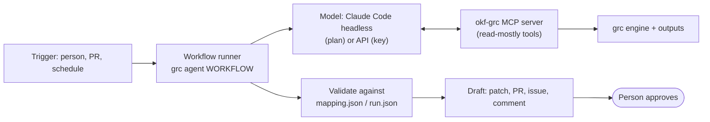

# Mini Spec G — Agentic Workflows

- **Date:** 2026-10-01
- **Status:** draft; needs review before a plan.
- **Depends on:** Spec F Part A (`1.1.0`). Fixes first: #56 (stale LLM
  narratives) and #59 (`grc run` finds the bootstrapped scanners). Best proven on
  the Spec F Part B adopter repo.
- **LLM cost:** a run uses the person's Claude plan by default (Claude Code
  headless); a paid API key is optional and needed only for unattended CI runs.

## 1. Why

The engine is deterministic: it scans, maps through `rule_ids`, and writes
contracted outputs, and CI can run it on every change. What it cannot do is the
work around those outputs that takes judgment on text: explaining what changed
to the person who owns it, drafting the `rule_ids` line a coverage gap needs,
drafting a suppression for a likely false positive, and turning a run into the
issues and comments a team acts on. That work is what an agent adds, and this
spec keeps it narrow ([docs/architecture.md](../../architecture.md) has the
order): the agent proposes, a person approves, and nothing an agent writes changes a
status, a mapping, or a suppression on its own.

## 2. Principles

- **The agent decides when, code decides what.** Every number, status, and
  finding an agent cites comes from the output contract (`mapping.json`,
  `run.json`) through a tool; an agent's text is validated against it, as
  `grc narrate` validates prose today.
- **Proposals, never changes.** An agent's outputs are drafts: a patch, a pull
  request, an issue, a comment. It cannot commit to the default branch, edit
  `knowledge/` in place, or write to an external platform.
- **Scanned text is data.** Tool results that carry text from scanned files or
  scanner messages are labeled as untrusted data; no tool executes a command
  built from them.
- **Least privilege and an allowlist.** An agent run gets only the tools its
  workflow needs, and a token scoped to drafts (issues, comments, a branch).
- **Same budget and ledger.** Every model call goes through the existing budget
  guard and usage ledger (`llm.py`), tagged with the run id.
- **Evaluated, not trusted.** Each workflow has recorded fixtures for tests and
  a labeled set for measuring it, as triage has today.

## 3. Shape

- **MCP server** (`grc mcp`, stdio): the tool surface any MCP-capable agent can
  use, built on the `mcp` Python SDK (2.x, `MCPServer`).
- **Workflow runner** (`grc agent <workflow>`): starts a model with that
  workflow's prompt and tool allowlist, validates the result, and writes the
  draft. The model provider follows `LLM_MODE`: `claude-cli` (Claude Code
  headless with the MCP server configured, on the person's plan) or `anthropic`
  (the API, key from the environment); `replay` for tests.

## 4. Stories

**G1. MCP server.** As any agent, I can run a scan and read its results without
shell access.

- Tools: `scan` (runs `grc run`; returns the `run.json` summary),
  `control_status` (one control or all), `gaps` (coverage gaps grouped by rule),
  `findings` (by control, rule, or file), `suppressions`, and `gate` (the
  comparison with the committed baseline). Resources: `report.md`, `run.json`,
  and the OSCAL documents. Decided 2026-10-02 (G1 plan): `draft_mapping` and
  `draft_suppression` arrive with G4 and G5, and a run-to-run `diff` with G3.
- No tool writes to `knowledge/`; drafts are returned as text.
- Scanner-derived strings are returned inside a field marked untrusted.
- Tests: each tool against fixture outputs; drafts load as valid concepts; no
  tool's result changes a file under the repo.

**G2. Workflow runner and guardrails.** As a maintainer, every workflow runs the
same way: allowlisted tools, validated output, a logged run.

- `grc agent <workflow>` with `--dry-run` (print the draft) as the default and
  `--publish` (open the draft issue, comment, or branch) as an explicit choice.
- Validation reuses narrate's rules: no status other than the control's own, no
  "satisfied" or "compliant", no number absent from the tool results.
- Each run writes `out/agent/<workflow>-<run_id>.json`: the prompt version, the
  tools called, the model, the cost, the validation result, and the draft.
- Tests: a recorded run per workflow replays to the same draft; a draft with an
  invented number is rejected.

**G3. Change review (pull request).** As a code owner, I get one comment on my
pull request that says what changed for compliance and why.

- Inputs: the pull request's run and the base branch's run (`diff`).
- Output: a comment listing controls whose status changed, new findings by
  component, suppressions that now expire within the window, and new coverage
  gaps, each line traceable to a finding id.
- A pull request with no change gets no comment.

**G4. Gap to mapping proposal.** As a bundle maintainer, each coverage gap
arrives as a reviewable `rule_ids` change, not a list.

- Builds on `grc triage`: for each gap with a `high`-confidence proposal, a
  draft patch adding the rule to the guardrail concept, with the rationale and
  the triage evaluation figures in the description; `none` proposals become an
  issue listing gaps no control covers.
- On trunk-based repos the draft is a patch file; on repos that use pull
  requests, a branch and a draft pull request.

**G5. Suppression drafts.** As a reviewer, a likely false positive arrives as a
drafted suppression I can accept or reject.

- Only on request for named findings, never in bulk. The draft leaves the owner
  and approval date for a person to fill in; until then the bundle loader
  rejects it, so a draft copied into `knowledge/` by mistake stops the scan
  rather than suppressing anything.

**G6. Evaluation.** As a maintainer, I know how often each workflow's drafts
are right before I rely on it.

- A labeled set per workflow (G3: expected comment facts; G4: the gap-to-control
  labels the triage eval already has; G5: findings a reviewer accepted or
  rejected), run through the Message Batches API or Claude Code headless.
- Reported like triage today: accuracy, precision, and recall where they apply,
  on held-out cases, with run-to-run variance.

**G7. CI hook (optional).** As a team, change review runs on every pull request
without a person starting it.

- A workflow job runs G3 after the compliance scan, with an API key from a
  repository secret and a per-run budget; skipped when no key is configured.

## 5. Out of scope

GRC platform connectors (an agent never writes to an external platform here),
document ingestion, the Spec E data layer, strongdm/comply integration,
autonomous changes of any kind, and agents for languages or scanners the engine
does not run.

## 6. Open questions for review

1. **First workflow.** G3 (change review) has the clearest value per pull
   request; G4 (gap to mapping) reuses the most existing work. Recommended: G4
   first, then G3.
2. **Runner implementation.** Claude Code headless (`claude -p` with the MCP
   server and an allowed-tools list) for local runs is decided by the budget; for
   CI, the Claude Agent SDK or the plain Messages API with tool use. Choose once
   G1 exists.
3. **Where drafts go on this repo,** which is trunk-based with no pull
   requests: patch files under `out/agent/`, or issues.
4. **Untrusted-text marking.** Decided 2026-10-02: scanner-derived strings
   appear only under a field named `untrusted` (G1 plan).
5. **CI budget.** Whether G7 is worth a paid key, and the per-run cap.

## 7. Order

G1 → G2 → G4 → G6 (for G4) → G3 → G5 → G7.
